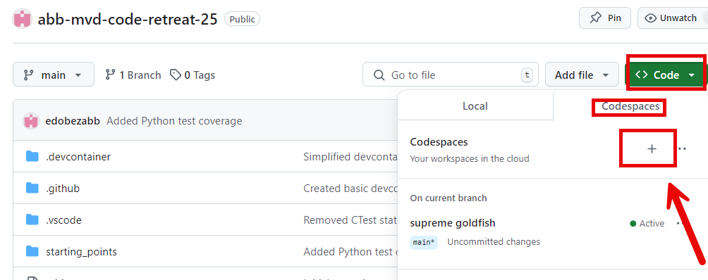

# ABB MVD Code Retreat 25

Welcome to the ABB MVD Code Retreat 25 repository! This repository contains various starting points for coding exercises and challenges designed to improve your coding skills and problem-solving abilities.

## Structure

The repository is organized into several folders, each containing a different starting point for a coding exercise. 
You can find detailed instructions and information about each exercise in the respective README files inside the "starting_points" folders.

## Getting Started

This starting repo was created with the idea to be used with its devcontainer, so that the environment is already prepared.
In particular the idea is to use it with GitHub Codespaces, to further simplify the environment creation.
It is also possible to deploy the devcontainer locally, if you know what you are doing.

### Codespaces

In order to create a codespace for this repo, click on Code -> Codespaces -> + symbol,
as shown below:

This will create a VSCode virtual instance ready for the event.